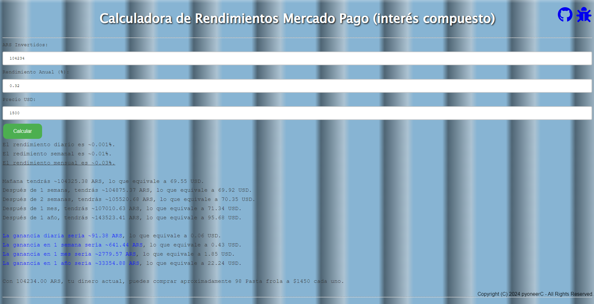

# Calculadora de Rendimientos de Mercado Pago

Este proyecto es una calculadora web sencilla que te permite calcular los intereses de tus inversiones con Mercado Pago. Está diseñada para ser fácil de usar y proporciona un resultado claro y conciso de tus posibles ganancias.

## Características

- Calculá los rendimientos diarios, semanales, mensuales y anuales de tu inversión.
- Compará tus retornos tanto en ARS como en USD.
- Considerá el impacto de la inflación en tu inversión.

## Uso

Para usar la calculadora, simplemente introduce los siguientes detalles:

- La cantidad que has invertido en ARS.
- La tasa de retorno anual (%).
- El precio actual del USD.
- La tasa de inflación mensual (%).

Una vez que hayas introducido estos detalles, haz clic en el botón "Calcular" para obtener tus resultados.

## Contribuciones

Damos la bienvenida a las contribuciones a este proyecto. Si tienes una solicitud de función, un informe de error, o quieres mejorar la calculadora, no dudes en abrir un problema o enviar una solicitud de extracción en nuestro [repositorio de GitHub](https://github.com/pyoneerC/intereses-mercado-pago).

## Descargo de responsabilidad

La información proporcionada por esta calculadora es solo una estimación y no debe tomarse como asesoramiento de inversión. Por favor, consulta con un asesor financiero antes de tomar cualquier decisión de inversión.

## Derechos de autor

Este código pertenece al [dominio público](LICENSE).

[Probala Hoy!](https://pyoneerc.github.io/rendimientos-mercado-pago/)
